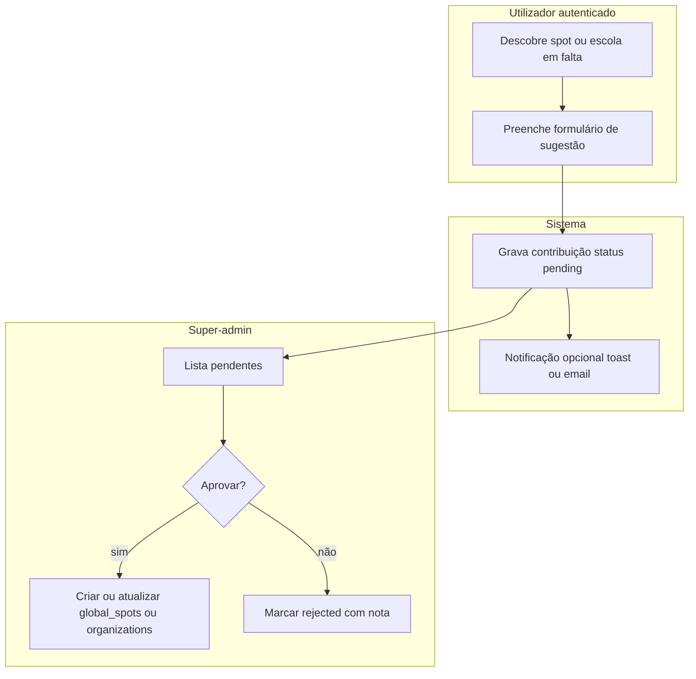

# Plano: contribuições da comunidade, moderação e painel super-admin

## 1. Conceitos e cenários

### Estados mentais dos dados

| Conceito | Significado |
| -------- | ----------- |
| **Catálogo oficial** | `global_spots` e `organizations` como hoje — visíveis no site e utilizáveis na operação. |
| **Contribuição** | Proposta criada por um utilizador (novo spot, nova escola, ou correção) ainda **não** promovida ao catálogo. |
| **Moderação** | Super-admin **aprova** (cria/ajusta registo oficial), **rejeita** (com motivo opcional) ou **pede alterações** (fase 2). |
| **Reivindicação (claim)** | Dono/gestor prova vínculo com uma escola **já** no catálogo — pode ser **fase posterior** às simples sugestões (menos escopo inicial). |

### Cenários principais

1. **S1 — Sugerir novo spot global**  
   Rider vê mapa/lista; “Sugerir spot”; envia nome, país/estado, coords opcionais, notas. Fica `pending`. Super-admin aprova → novo `global_spots` (slug gerado ou editado na revisão).

2. **S2 — Sugerir nova escola**  
   Semelhante; campos: nome, site/IG opcional, localização textual. Aprovação → nova `organizations` + eventual convite ao contacto (fase 2).

3. **S3 — Corrigir dados de um spot/escola existente**  
   Contribuição do tipo `correction` ligada a `target_global_spot_id` ou `target_organization_id`; moderador aplica diff no registo oficial ou rejeita.

4. **S4 — Utilizador não autenticado**  
   **Fase 1 (simples):** só utilizadores **logados** sugerem (reduz spam, rastreio `submitted_by_user_id`). Anónimos: “Crie conta para sugerir” ou formulário com CAPTCHA (fase 2).

5. **S5 — Dono ainda não na plataforma**  
   Escola entra pelo **S2** aprovado; depois fluxo **convite** já existente ([`prisma/schema.prisma`](prisma/schema.prisma) — model `invites`) ou **claim** futuro — não precisa estar no MVP da fila.

---

## 2. Boas práticas (referência de mercado)

- **Transparência:** na ficha pública, quando dados forem “oficiais” vs “comunidade”, badge discreto (“Verificado pela escola” / “Dados da comunidade”) — pode ser fase 2.
- **Uma fonte de verdade:** após aprovação, o registo oficial vive em `global_spots` / `organizations`; a contribuição fica histórica (`status: approved`, `resolved_global_spot_id` opcional).
- **Anti–open redirect / anti-spam:** utilizador autenticado, rate limit por IP/user, campos validados com Zod, textos com limite de tamanho.
- **Auditoria:** `created_at`, `reviewed_at`, `reviewed_by_user_id`, `moderator_note` (interno) e opcionalmente `rejection_reason` (pode mostrar ao utilizador em “Minhas sugestões” — fase 2).
- **LGPD:** não pedir dados desnecessários; política de privacidade mencionar contribuições.
- **Alinhamento com o projeto:** fluxo **UI → Server Action → `domain/*/repo.ts` → Prisma**; permissões `requireActionPermission` / `requirePermission` para super-admin nas actions de revisão ([CLAUDE.md](CLAUDE.md)).

---

## 3. Implementação simples (MVP sugerido)

### Modelo de dados (uma tabela polimórfica)

Uma única tabela `community_submissions` (ou `place_contributions`) evita duplicar lógica no MVP:

- `id`, `uuid`, `kind` enum string: `new_global_spot` | `new_organization` | `correction_spot` | `correction_org`
- `status`: `pending` | `approved` | `rejected`
- `payload` **Json** — campos do formulário (nome, país, estado, lat/lng, descrição, URLs, `target_id` para correções)
- `submitted_by_user_id` (FK `users`)
- `reviewed_by_user_id` nullable, `reviewed_at` nullable, `moderator_note` nullable
- `created_at`, `updated_at`, `deleted_at` (soft delete opcional)
- Opcional: `result_global_spot_id` / `result_organization_id` após aprovação para link rápido

**Porquê Json no MVP:** menos migrações quando evoluíres campos; valida com Zod por `kind` no servidor.

### Backend

- Novo módulo em [`src/domain/community-submissions/`](src/domain/) (ou nome alinhado ao que escolheres): `schema.ts`, `repo.ts`, `service.ts` só se a transação aprovar+criar spot for complexa.
- **Actions:** `submitCommunitySubmission` (qualquer role autenticado ou só `student` — decisão de produto), `listPendingSubmissions` + `approveSubmission` + `rejectSubmission` (só `superadmin`).
- **Super-admin UI:** nova rota em [`src/app/(super-admin)/super-admin/`](src/app/(super-admin)/super-admin/) com DataTable ou cards mobile-first, detalhe em Sheet com preview do `payload` e botões Aprovar / Rejeitar.

### Frontend utilizador

- Entrada clara: botão “**Sugerir spot**” / “**Sugerir escola**” nas páginas públicas de spots/centros (ou menu conta aluno) → **Drawer** mobile / **Sheet** desktop com formulário curto.
- Após envio: toast “Obrigado — a equipa vai analisar.”

### O que **não** fazer no MVP

- Claim de escola com upload de documento; email automático ao moderador; painel “minhas sugestões” para o utilizador — podem ser **fase 2**.

---

## 4. Usabilidade (UX)

- **Formulário curto:** poucos campos obrigatórios (nome + localização aproximada); o resto opcional.
- **Expectativas:** texto curto sob o botão — “A sugestão será analisada antes de aparecer no mapa.”
- **Feedback:** estados de loading, erro de rede, sucesso claro.
- **Moderador:** lista com filtro `pending` primeiro, contagem no dashboard super-admin (“X pendentes”), link direto para a nova rota.
- **Acessibilidade:** labels, `aria` nos botões de ação, foco ao abrir Sheet/Drawer.

---

## 5. Como chamar o painel (nomenclatura)

Nomes em **português** adequados ao tom eKite:

| Nome (UI) | Rota sugerida | Notas |
| --------- | ------------- | ----- |
| **Contribuições** | `/super-admin/contribuicoes` | Curto; neutro; abrange spots e escolas. |
| **Revisão da comunidade** | `/super-admin/revisao-comunidade` | Deixa claro que é moderação de terceiros. |
| **Sugestões** | `/super-admin/sugestoes` | Muito simples; pode confundir com “sugestões internas” no futuro. |
| **Central de moderação** | `/super-admin/moderacao` | Genérico se no futuro houver mais filas (fotos, reviews). |

**Recomendação principal:** label na sidebar **“Contribuições”** com subtítulo ou badge **“Pendentes”** quando `count > 0`; rota **`/super-admin/contribuicoes`**. Em copy para utilizadores, usar **“Sugerir um spot”** / **“Sugerir uma escola”** — linguagem ativa, não “submeter contribuição” no botão principal.

Atualizar [`src/lib/constants.ts`](src/lib/constants.ts) (`SUPERADMIN_NAV_ITEMS`) e [`src/components/layout/super-admin-sidebar.tsx`](src/components/layout/super-admin-sidebar.tsx) (`iconMap` com ícone tipo `Inbox` ou `MessageCircle` do Lucide se exportado em [`src/lib/icons.ts`](src/lib/icons.ts)).

---

## 6. Ordem de entrega sugerida

1. Migration + Prisma model + domain repo/schema.
2. Server actions (submit + list + approve + reject) com transação na aprovação (criar `global_spots` / `organizations` + update submission).
3. Página super-admin lista + detalhe.
4. Formulário público mínimo + entrada nas páginas escolhidas.
5. Badge/contador no dashboard super-admin.
6. `npm run build` e testes manuais dos quatro status/kinds principais.
